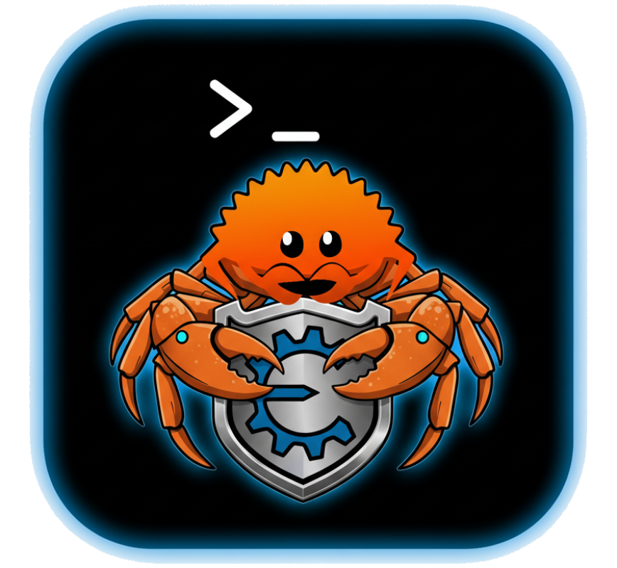
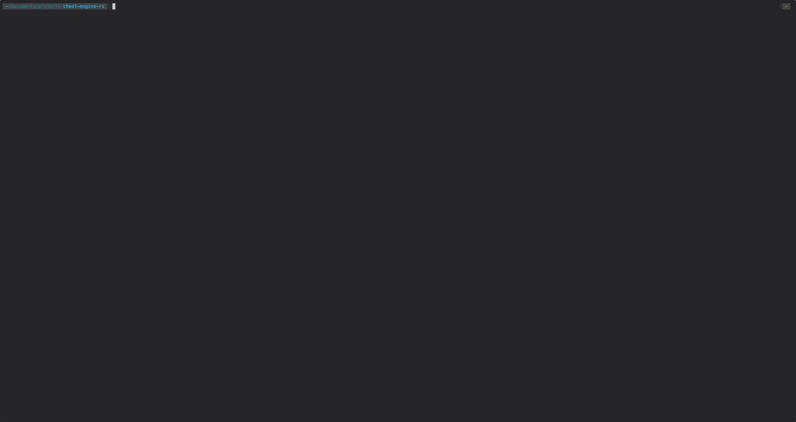

# CheatEngineRS

<p align="center">
  
</p>

A minimal CheatEngine implementation built with Rust and a terminal UI.

[](https://asciinema.org/a/QwTnsAF9VzyFUBYLqTVLvAf9S)

## What is this?

This is a simple memory scanner that lets you find and change values in running programs. Think of it like the original Cheat Engine but way more basic and running in your terminal.

## What it can do

- Scan memory for 32-bit and 64-bit numbers
- Filter results by comparing old and new values
- Watch memory addresses in real-time
- Terminal-based UI using keyboard shortcuts

## Supported Systems

- **macOS** (tested on Apple Silicon with macOS Tahoe)
- **Linux** (basic support)

**Note:** This has only been tested on Apple Silicon Macs running macOS Tahoe.

## Requirements

- Rust (latest stable version)
- Root access (required to read other programs' memory)

## Installation

1. Clone this repo:
```bash
git clone https://github.com/yourusername/cheat-engine-rs.git
cd cheat-engine-rs
```

2. Build the project:
```bash
cargo build --release
```

3. Run it (needs root):
```bash
sudo ./target/release/cheat-engine-rs
```

## How to use it

1. Start the program with `sudo`
2. Pick a process from the list
3. Do a first scan for a value
4. Change the value in the target program
5. Do a next scan to filter results
6. Keep scanning until you find the right address

## Running Tests

### Standard tests:
```bash
cargo test
```

### Tests that need root access:

First, build the example program:
```bash
cargo b --example simple_program
```

Then run root tests:
```bash
sudo su
CARGO_TARGET_DIR=/tmp/target-root cargo test -- --include-ignored
```

## TODO

- [ ] Windows support
- [ ] More data types (floats, doubles, strings, etc.)
- [ ] Separate UI and worker threads
- [ ] Speed up initial scan with parallel processing (rayon)
- [ ] Pointer scanning
- [ ] Save/load scan results

## Why root?

This program needs to read memory from other running programs. Operating systems don't let normal programs do this for security reasons. Running as root gives the needed permissions.

## License

MIT
